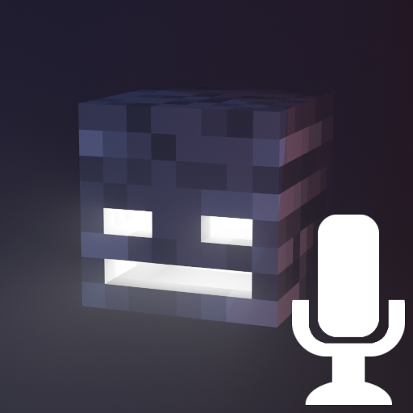

  

<h1 align="center">Dread Announcer Packs</h1>

<h3>About Announcers</h3>

These resource packs are designed to work with Dread, a Minecraft utility mod designed for anarchy servers, primarily Constantiam.

You are free to use these pack outside of their intended use, though without additional mods they do not function.

<h3>Sounds Supported</h3>
<ul>
  <li><b>Grenade</b> (Plays when a creeper sneaks up on the player)</li>
  <li><b>Player Load</b> (Plays when another player enters render distance)</li>
  <li><b>Player Unload</b> (Plays when another player leaves render distance)</li>
  <li><b>Kill</b> (Plays for a single kill)</li>
  <li><b>Double Kill</b> (Plays for two consecutive kills)</li>
  <li><b>Triple Kill</b> (Plays for three consecutive kills)</li>
  <li><b>Quadrakill</b> (Plays for four consecutive kills)</li>
  <li><b>Pentakill</b> (Plays for five consecutive kills)</li>
  <li><b>Excessive Kill</b> (Plays for consecutive kills over five)</li>
  <li><b>Death</b> (Plays when the player dies)</li>
</ul>

<h3>Credits</h3>
<ul>
  <li><b>Kreivon</b> | Compiling the resourcepacks</li>
  <li><b>Various Others</b> | Details available per resource pack</li>
</ul>
