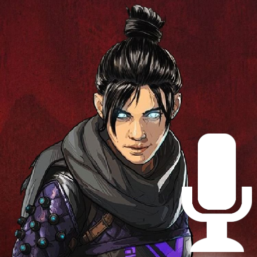

  

<h1 align="center">Wraith Announcer Pack</h1>

<h3>About Announcers</h3>

This resource pack is designed to work with Dread, a Minecraft utility mod designed for anarchy servers, primarily Constantiam.

You are free to use this pack outside of its intended use, though without additional mods this resource pack does not function.

Other announcer packs are available <a href="https://github.com/kreivon/DreadAnnouncers">on GitHub</a>.

<h3>Sounds Included</h3>
<ul>
  <li>Grenade</li>
  <li>Player Load</li>
</ul>

<h3>Credits</h3>
<ul>
  <li><b>Kreivon</b> | Compiling the resourcepack</li>
  <li><b>Shantel VanSanten</b> | Voice of Wraith</li>
  <li><b>Respawn Entertainment</b> | Rights to the character</li>
  <li><b>Electronic Arts</b> | Rights to the character</li>
</ul>
